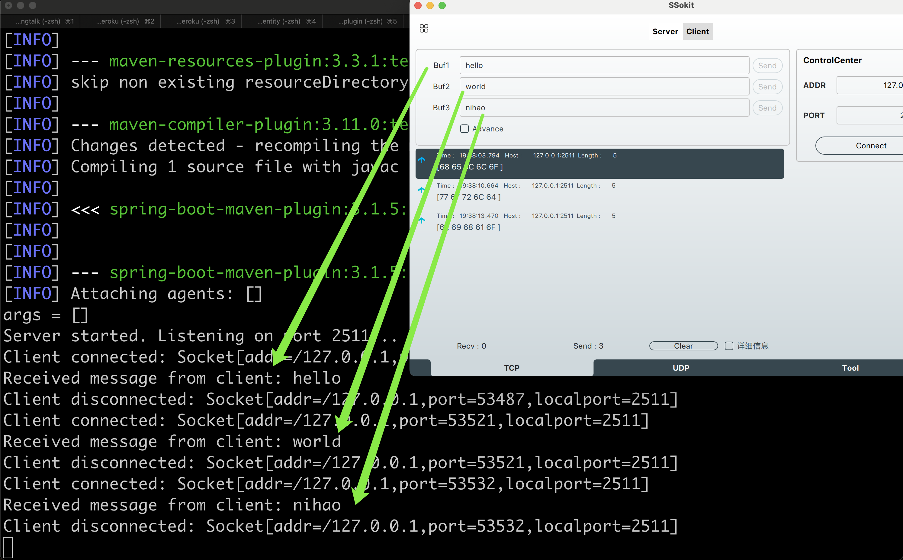
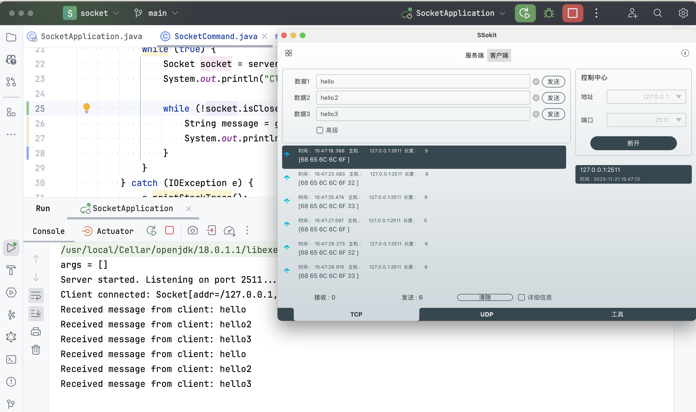

# socket

---

> 一个使用 SpringBoot 的 Socket 编程示例

## 创建

https://start.spring.io/#!type=maven-project&language=java&platformVersion=3.1.5&packaging=jar&jvmVersion=17&groupId=dev.brickverse&artifactId=socket&name=socket&description=Socket%20Demo%20project%20for%20Spring%20Boot&packageName=dev.brickverse.socket&dependencies=spring-shell

## 运行

```shell
mvn spring-boot:run
```

## 截图

### 第一版



### 第二版



## 💵 了解更多

欢迎来知乎[向我咨询](https://www.zhihu.com/consult/people/1073548674713423872)！

[](https://www.zhihu.com/consult/people/1073548674713423872)

